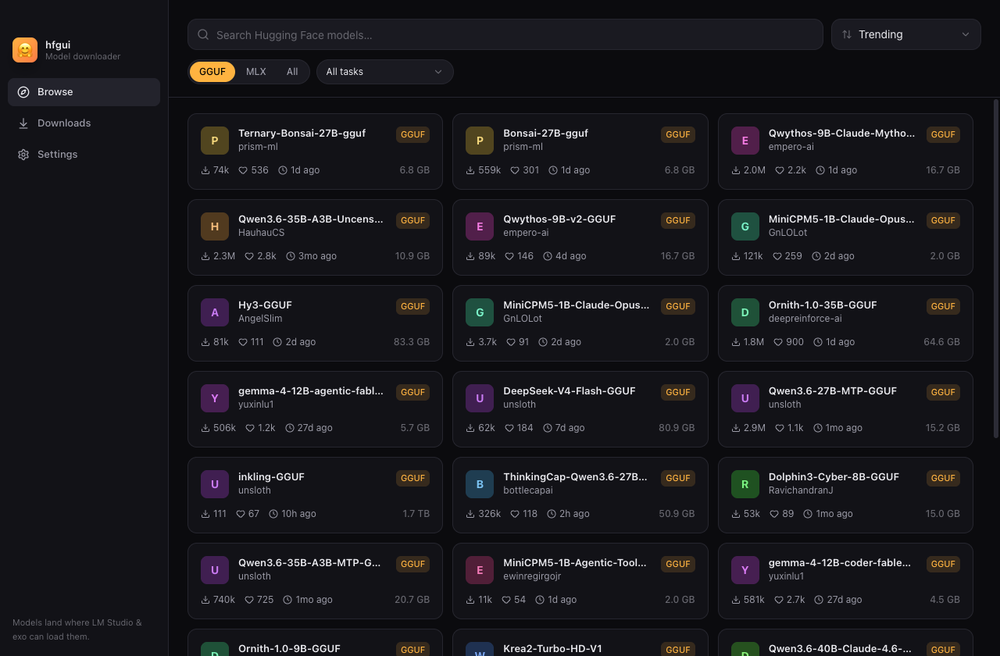

# hfgui

A modern Electron app for browsing and downloading Hugging Face models — straight into the
folders where **LM Studio** and **exo** pick them up. No manual file moving.



## What it does

- **Browse** the Hugging Face Hub: search, sort by Trending / Most downloaded / Most liked /
  Recently updated, filter by format (GGUF / MLX) and task.
- **Model detail**: GGUF quantizations grouped (multi-part files collapsed), file sizes,
  a "fits your RAM" hint per quant, full file list for MLX repos.
- **Download engine**: parallel jobs, pause / resume / cancel, resumable across app restarts
  (HTTP Range + `.partial` files, atomic rename on completion), disk-space pre-flight,
  speed / ETA, gated-model token support (stored encrypted via `safeStorage`).
- **Destinations**
  - **LM Studio** → `~/.lmstudio/models/{publisher}/{model}/` (auto-detected, including a
    custom models folder configured in LM Studio). Models appear after reopening LM Studio.
  - **exo** → `~/.exo/models/{org}--{model}/` (flat repo folder; exo loads complete folders
    automatically). Offered for MLX models.
  - **Custom folder** for anything else.

## Development

Requires Node 22+.

```sh
npm install
npm run dev        # run with HMR
npm run typecheck  # tsc over main/preload + renderer
npm test           # vitest unit tests (quant parsing, formatting)
npm run build      # production bundles into out/
npm start          # preview the production build
```

End-to-end tests (drive the real app, real downloads — needs network):

```sh
npm run build
node scripts/e2e.mjs      # GGUF download to a temp dir, pause/resume mid-flight
node scripts/e2e-mlx.mjs  # multi-file MLX repo into the detected exo models dir
node scripts/screenshot.mjs /tmp/shots   # grab UI screenshots
```

## Architecture

- `src/main/` — Electron main process: download manager (queue → job state machine →
  per-file streaming downloader), destination path adapters, settings + encrypted token store.
- `src/preload/` — `contextBridge` shim exposing the typed `window.hfgui` API.
- `src/renderer/` — React 19 + Tailwind v4 + Radix UI; talks to the HF API directly
  (search / model info / file trees) and to main over IPC for downloads and settings.
- `src/shared/` — types, the IPC contract, GGUF quant parsing, formatters.

Built with electron-vite. Downloads re-resolve `huggingface.co/{repo}/resolve/{sha}/{path}`
fresh on every start/resume (CDN URLs are short-lived signed URLs), pin the repo commit sha
per job, and never forward the HF token past the CDN redirect.
