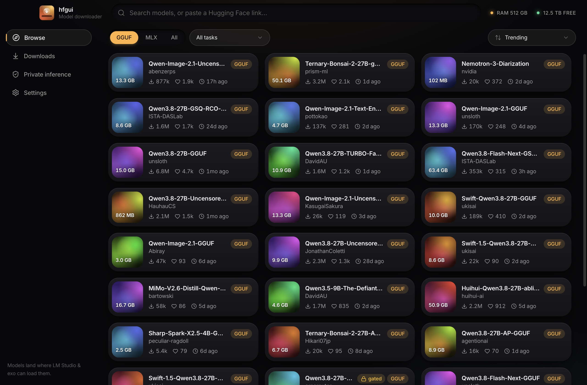

# hfgui

A modern Electron app for browsing and downloading Hugging Face models — straight into the
folders where **LM Studio** and **exo** pick them up. No manual file moving.



## What it does

- **Browse** the Hugging Face Hub: search, sort by Trending / Most downloaded / Most liked /
  Recently updated, filter by format (GGUF / MLX) and task.
- **Paste a link.** The search field doubles as an omnibox: paste any
  `huggingface.co/org/model` URL (or type a bare `org/model`) and it resolves straight to
  the model instead of keyword-searching. `/tree/`, `/blob/` and `/resolve/` links work too.
  You can also **drag a link from your browser onto the window**, and when hfgui regains
  focus with a Hub link on the clipboard it offers to open it — the clipboard is read and
  parsed in the main process, so nothing but a model name ever reaches the UI.
- **Model detail**: GGUF quantizations grouped (multi-part files collapsed), file sizes,
  a "fits your RAM" hint per quant, full file list for MLX repos.
- **Download engine**: parallel jobs, pause / resume / cancel, resumable across app restarts
  (HTTP Range + `.partial` files, atomic rename on completion), disk-space pre-flight,
  speed / ETA, gated-model token support (stored encrypted via `safeStorage`).
- **Speed limit**: cap the combined speed of all downloads so calls and browsing keep working.
  One click from the speed readout in the top bar, or in Settings; applies instantly to
  downloads already running. It throttles the connection itself — held-back chunks
  back-pressure the socket, so TCP slows the sender — not just the disk writes. Switched on
  mid-download with a cap that wouldn't bite, it picks one under half the current speed instead.
- **Downloads dock**: live progress from any view, with pause and cancel in reach. The
  Downloads page keeps the history, Finder access and exo registration status.
- **Drag a card onto a destination** to start a download without opening the model. For
  GGUF repos that starts the quantization hfgui would have recommended for your RAM, and
  says which one it picked with Change / Undo. Every path is also a button.
- **Destinations**
  - **LM Studio** → `~/.lmstudio/models/{publisher}/{model}/` (auto-detected, including a
    custom models folder configured in LM Studio). Models appear after reopening LM Studio.
  - **exo** → `~/.exo/models/{org}--{model}/` (flat repo folder; exo loads complete folders
    automatically). Offered for MLX models.
  - **Custom folder** for anything else.

## Design

Dark-first, with a matching light theme (System / Light / Dark in Settings). Every model
gets deterministic "cover art" — a gradient mesh derived from its repo id, with the hue
family coming from the author — so a repo always looks the same and a page of results from
one org reads as a set. It is pure CSS: no WebGL, and nothing animates inside the grid.

## Development

Requires Node 22+.

```sh
npm install
npm run dev        # run with HMR
npm run typecheck  # tsc over main/preload + renderer
npm test           # vitest unit tests (link parsing, quant parsing, speed limiter, drop rules)
npm run build      # production bundles into out/
npm start          # preview the production build
npm run icon       # re-render build/icon.icns + icon.png from build/icon.svg
```

End-to-end tests (drive the real app, real downloads — needs network):

```sh
npm run build
node scripts/e2e.mjs        # GGUF download to a temp dir, pause/resume mid-flight
node scripts/e2e-mlx.mjs    # multi-file MLX repo into the detected exo models dir
node scripts/e2e-paste.mjs  # omnibox paste, link drop, clipboard chip, drag-to-download
node scripts/e2e-throttle.mjs # speed cap: app rate + real socket rate via nettop, live toggle
node scripts/screenshot.mjs /tmp/shots both   # UI screenshots, dark + light
```

## Architecture

- `src/main/` — Electron main process: download manager (queue → job state machine →
  per-file streaming downloader), destination path adapters, settings + encrypted token store.
- `src/preload/` — `contextBridge` shim exposing the typed `window.hfgui` API.
- `src/renderer/` — React 19 + Tailwind v4 + Radix UI; talks to the HF API directly
  (search / model info / file trees) and to main over IPC for downloads and settings.
- `src/shared/` — types, the IPC contract, GGUF quant parsing, link parsing, destination
  rules, drop planning, formatters. All pure and unit-tested.

Built with electron-vite. Downloads re-resolve `huggingface.co/{repo}/resolve/{sha}/{path}`
fresh on every start/resume (CDN URLs are short-lived signed URLs), pin the repo commit sha
per job, and never forward the HF token past the CDN redirect. Inter is bundled and inlined
as a `data:` URI because the packaged renderer runs from `file://`, where CSP
`font-src 'self'` does not reliably match.
